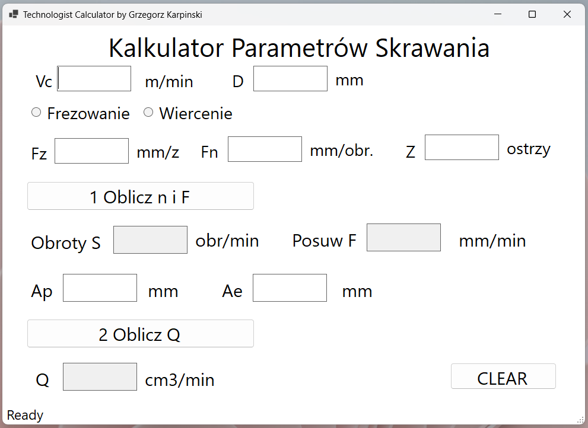
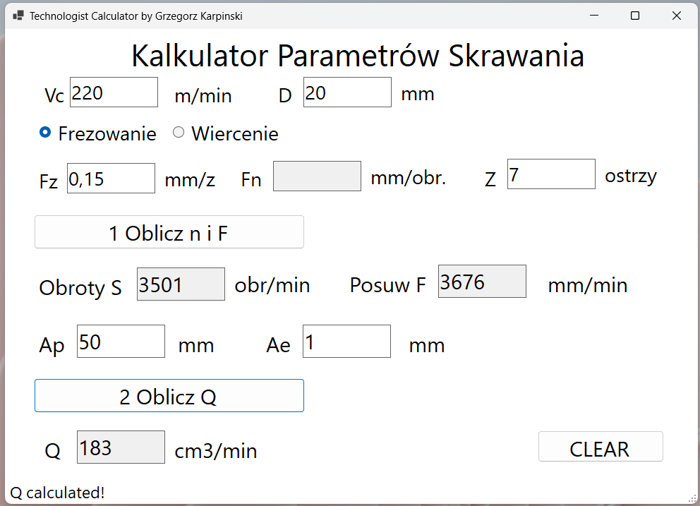

# Machininig Calculator
Machining Calculator provides graphical interface for calculating basics milling and drilling parameters. Its tool for simplifying routine calculations any machining engineer do daily. Ideal for technologists or machinists.

## Technologies Used
* C#
* .NET 8
* WinForms

## Using The App
1. Download the executable file from the release section.
2. When the application launches it should look like this:

3. Fill in data for your tool and hit calculate buttons:

4. Enjoy!

## Upcoming Changes
* Adding more specific error info
* selecting parameters using the slider from the given range
* ability to save to file
